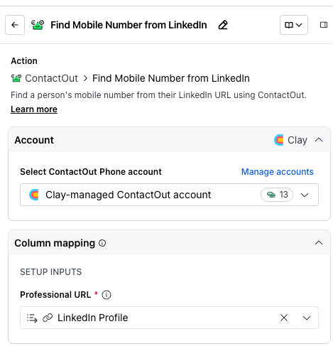
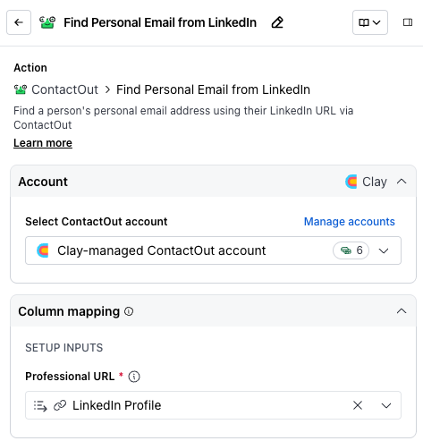
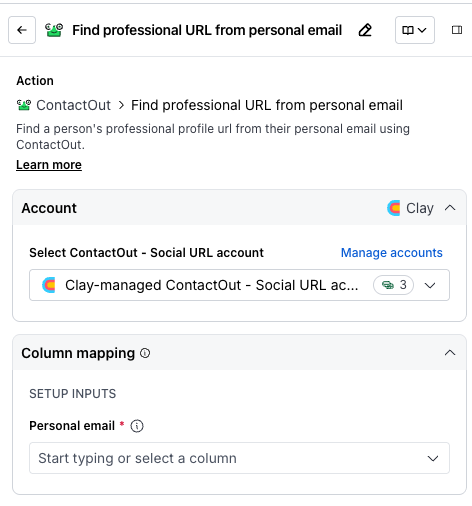

# ContactOut integration

Find accurate professional emails and phone numbers.

ContactOut is a lead generation tool for finding accurate contact information and professional data.

With this integration, you can enrich your Clay data with verified email addresses, phone numbers, and other professional details about your prospects.

Clay's ContactOut integration includes the following actions:

-   Find Mobile Number from Profile
-   Find Personal Email from Profile
-   Find professional URL from personal email

We'll cover how to connect Clay to ContactOut, then we'll go over each action that is available with ContactOut.

## **Enriching data with ContactOut**

1.  While in a Clay table, click `Add enrichment` and search for `ContactOut`.
2.  Under `Integrations`, select one of the ContactOut options.
3.  In the modal, you will be asked to `Select ContactOut account`.
    -   If you have your own account, click `+ Add account` and go through authentication. Otherwise, use the Clay provided key.

### `Action` Find Mobile Number from Profile

The **Find Mobile Number from Profile** action finds a person's mobile number from their LinkedIn URL using ContactOut.

**Step 1: Choose the ContactOut account you want to use**

First, you can use either the Clay-managed ContactOut account or your own account.

If you use the Clay-managed ContactOut account you will be charged at 13 credits per enriched cell. For more information on how Clay credits work, please refer to [this guide](https://www.clay.com/university/lesson/clay-credits-overview).

**Step 2: Enter optional and required setup inputs**

Please input the contact's **Professional URL** (their LinkedIn profile URL) to find their mobile number.

**Step 3 (Optional): Select Auto-update**

By default, ContactOut will auto-update the integration every 24 hours. This is optional. Make sure to toggle this step off if you do not want to auto-update, however, you might run into stale data problems.

For more information about how auto-update works, please read [this brief guide](https://docs.clay.com/en/articles/9642165-auto-update-and-auto-dedupe-table).

**Step 4 (Optional): Select conditional run criteria**

If you want to only run this enrichment under set circumstances, you are able to input formulas where the column runs only if the formula is true. Learn more about conditional runs in [this Clay University lesson](https://www.clay.com/university/lesson/ai-formulas-conditional-runs-clay-101#:~:text=Conditional%20runs%20\(which%20make%20use,personal%20emails%20for%20all%20rows\).\)).

**Step 5: Choose data to add as columns to table**

Select which data from the enrichment you'd like to add as columns to your table. Even if you choose not to add columns at this point, the enriched data will still be available and accessible for later use.

### `Action` Find Personal Email from Profile

The **Find Personal Email from Profile** action finds a person's personal email address using their LinkedIn URL via ContactOut.

**Step 1: Choose the ContactOut account you want to use**

First, you can use either the Clay-managed ContactOut account or your own account.

If you use the Clay-managed ContactOut account you will be charged at 6 credits per enriched cell. For more information on how Clay credits work, please refer to [this guide](https://www.clay.com/university/lesson/clay-credits-overview).

**Step 2: Enter optional and required setup inputs**

Please input the contact's **Professional URL** (their LinkedIn profile URL) to find their personal email.

**Step 3 (Optional): Select Auto-update**

By default, ContactOut will auto-update the integration every 24 hours. This is optional. Make sure to toggle this step off if you do not want to auto-update, however, you might run into stale data problems.

For more information about how auto-update works, please read [this brief guide](https://docs.clay.com/en/articles/9642165-auto-update-and-auto-dedupe-table).

**Step 4 (Optional): Select conditional run criteria**

If you want to only run this enrichment under set circumstances, you are able to input formulas where the column runs only if the formula is true. Learn more about conditional runs in [this Clay University lesson](https://www.clay.com/university/lesson/ai-formulas-conditional-runs-clay-101#:~:text=Conditional%20runs%20\(which%20make%20use,personal%20emails%20for%20all%20rows\).\)).

**Step 5: Choose data to add as columns to table**

Select which data from the enrichment you'd like to add as columns to your table. Even if you choose not to add columns at this point, the enriched data will still be available and accessible for later use.

### `Action` Find professional URL from personal email

The **Find professional URL from personal email** action finds a person's professional profile URL from their personal email using ContactOut.

**Step 1: Choose the ContactOut account you want to use**

First, you can use either the Clay-managed ContactOut - Social URL account or your own account.

If you use the Clay-managed ContactOut - Social URL account you will be charged at 3 credits per enriched cell. For more information on how Clay credits work, please refer to [this guide](https://www.clay.com/university/lesson/clay-credits-overview).

**Step 2: Enter optional and required setup inputs**

Please input the contact's **Personal email** to find their professional profile URL.

**Step 3 (Optional): Select Auto-update**

By default, ContactOut will auto-update the integration every 24 hours. This is optional. Make sure to toggle this step off if you do not want to auto-update, however, you might run into stale data problems.

For more information about how auto-update works, please read [this brief guide](https://docs.clay.com/en/articles/9642165-auto-update-and-auto-dedupe-table).

**Step 4 (Optional): Select conditional run criteria**

If you want to only run this enrichment under set circumstances, you are able to input formulas where the column runs only if the formula is true. Learn more about conditional runs in [this Clay University lesson](https://www.clay.com/university/lesson/ai-formulas-conditional-runs-clay-101#:~:text=Conditional%20runs%20\(which%20make%20use,personal%20emails%20for%20all%20rows\).\)).

**Step 5: Choose data to add as columns to table**

Select which data from the enrichment you'd like to add as columns to your table. Even if you choose not to add columns at this point, the enriched data will still be available and accessible for later use.

### **Run settings**

-   **Auto-update**
-   **Only run if:** The enrichment will only run if conditions are met. ([Learn more about conditional formulas here!](https://www.clay.com/university/lesson/ai-formulas-conditional-runs-clay-101))
