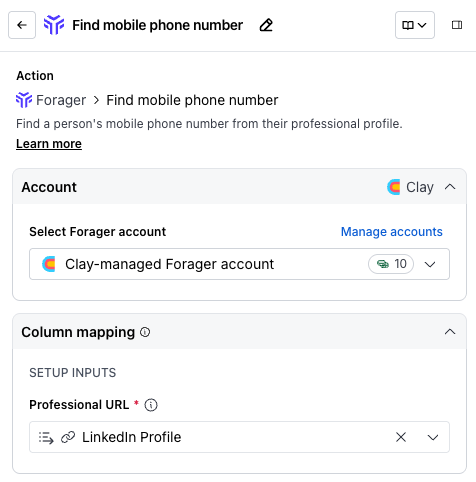
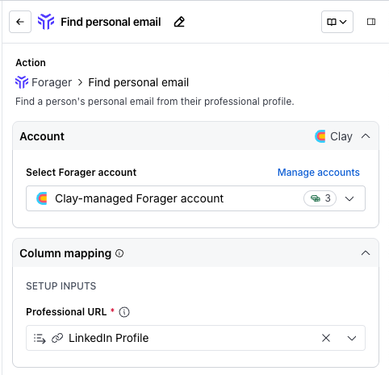
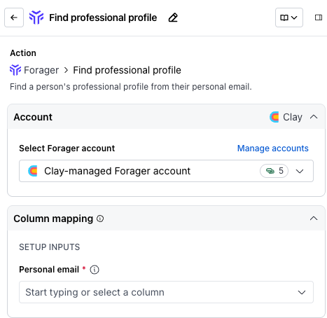

# Forager integration

Find phone numbers and emails based on a social profile.

The Forager integration allows you to find phone numbers and emails based on a social profile.

Clay's Forager integration includes the following actions:

-   Find mobile phone number
-   Find personal email
-   Find professional profile

We'll cover how to connect Clay to Forager, then we'll go over each action that is available with Forager.

## **Enriching data with Forager**

1.  While in a Clay table, click `Add enrichment` and search for `Forager`.
2.  Under `Integrations`, select one of the Forager options.
3.  In the modal, you will be asked to `Select Forager account`.
    -   If you have your own account, click `+ Add account` and go through authentication. Otherwise, use the Clay provided key.

### `Action` Find mobile phone number

The **Find mobile phone number** action finds a person's mobile phone number from their professional profile.

**Step 1: Choose the Forager account you want to use**

First, you can use either the Clay-managed Forager account or your own account.

If you use the Clay-managed Forager account you will be charged at 10 credits per enriched cell. For more information on how Clay credits work, please refer to [this guide](https://www.clay.com/university/lesson/clay-credits-overview).

**Step 2: Enter optional and required setup inputs**

Please input the contact's **Professional URL** (their LinkedIn profile URL) to find their mobile phone number.

**Step 3 (Optional): Select Auto-update**

By default, Forager will auto-update the integration every 24 hours. This is optional. Make sure to toggle this step off if you do not want to auto-update, however, you might run into stale data problems.

For more information about how auto-update works, please read [this brief guide](https://docs.clay.com/en/articles/9642165-auto-update-and-auto-dedupe-table).

**Step 4 (Optional): Select conditional run criteria**

If you want to only run this enrichment under set circumstances, you are able to input formulas where the column runs only if the formula is true. Learn more about conditional runs in [this Clay University lesson](https://www.clay.com/university/lesson/ai-formulas-conditional-runs-clay-101#:~:text=Conditional%20runs%20\(which%20make%20use,personal%20emails%20for%20all%20rows\).\)).

**Step 5: Choose data to add as columns to table**

Select which data from the enrichment you'd like to add as columns to your table. Even if you choose not to add columns at this point, the enriched data will still be available and accessible for later use.

### `Action` Find personal email

The **Find personal email** action finds a person's personal email from their professional profile.

**Step 1: Choose the Forager account you want to use**

First, you can use either the Clay-managed Forager account or your own account.

If you use the Clay-managed Forager account you will be charged at 3 credits per enriched cell. For more information on how Clay credits work, please refer to [this guide](https://www.clay.com/university/lesson/clay-credits-overview).

**Step 2: Enter optional and required setup inputs**

Please input the contact's **Professional URL** (their LinkedIn profile URL) to find their personal email.

**Step 3 (Optional): Select Auto-update**

By default, Forager will auto-update the integration every 24 hours. This is optional. Make sure to toggle this step off if you do not want to auto-update, however, you might run into stale data problems.

For more information about how auto-update works, please read [this brief guide](https://docs.clay.com/en/articles/9642165-auto-update-and-auto-dedupe-table).

**Step 4 (Optional): Select conditional run criteria**

If you want to only run this enrichment under set circumstances, you are able to input formulas where the column runs only if the formula is true. Learn more about conditional runs in [this Clay University lesson](https://www.clay.com/university/lesson/ai-formulas-conditional-runs-clay-101#:~:text=Conditional%20runs%20\(which%20make%20use,personal%20emails%20for%20all%20rows\).\)).

**Step 5: Choose data to add as columns to table**

Select which data from the enrichment you'd like to add as columns to your table. Even if you choose not to add columns at this point, the enriched data will still be available and accessible for later use.

### `Action` Find professional profile

The **Find professional profile** action finds a person's professional profile from their personal email.

**Step 1: Choose the Forager account you want to use**

First, you can use either the Clay-managed Forager account or your own account.

If you use the Clay-managed Forager account you will be charged at 5 credits per enriched cell. For more information on how Clay credits work, please refer to [this guide](https://www.clay.com/university/lesson/clay-credits-overview).

**Step 2: Enter optional and required setup inputs**

Please input the contact's **Personal email** to find their professional profile.

**Step 3 (Optional): Select Auto-update**

By default, Forager will auto-update the integration every 24 hours. This is optional. Make sure to toggle this step off if you do not want to auto-update, however, you might run into stale data problems.

For more information about how auto-update works, please read [this brief guide](https://docs.clay.com/en/articles/9642165-auto-update-and-auto-dedupe-table).

**Step 4 (Optional): Select conditional run criteria**

If you want to only run this enrichment under set circumstances, you are able to input formulas where the column runs only if the formula is true. Learn more about conditional runs in [this Clay University lesson](https://www.clay.com/university/lesson/ai-formulas-conditional-runs-clay-101#:~:text=Conditional%20runs%20\(which%20make%20use,personal%20emails%20for%20all%20rows\).\)).

**Step 5: Choose data to add as columns to table**

Select which data from the enrichment you'd like to add as columns to your table. Even if you choose not to add columns at this point, the enriched data will still be available and accessible for later use.

### **Run settings**

-   **Auto-update**
-   **Only run if:** The enrichment will only run if conditions are met. ([Learn more about conditional formulas here!](https://www.clay.com/university/lesson/ai-formulas-conditional-runs-clay-101))
