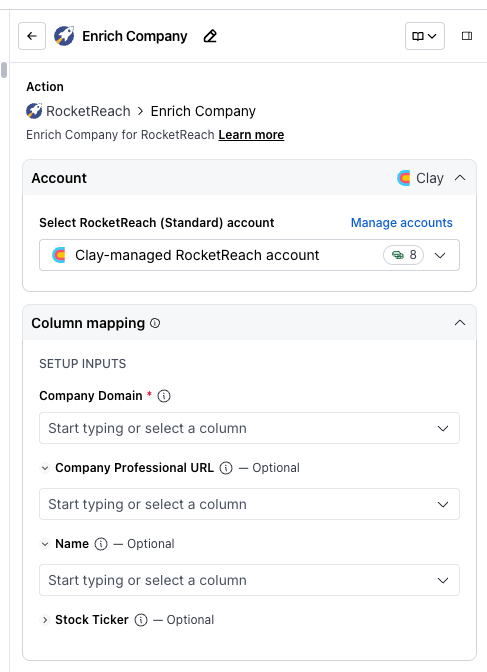
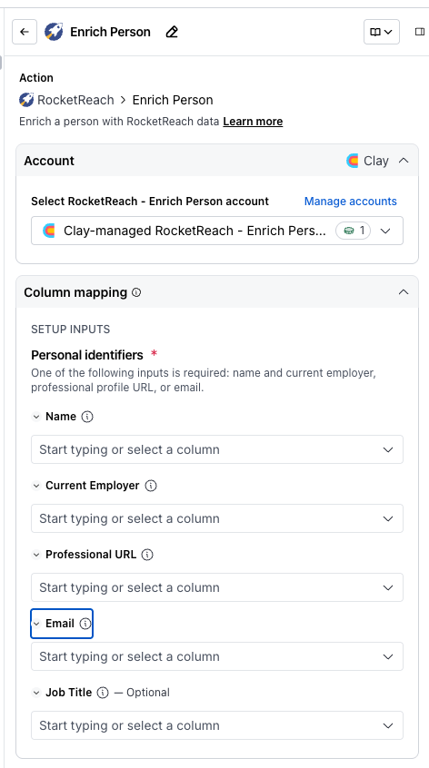
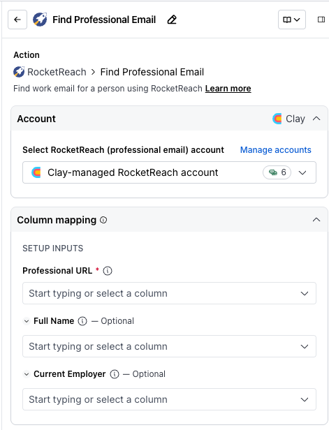
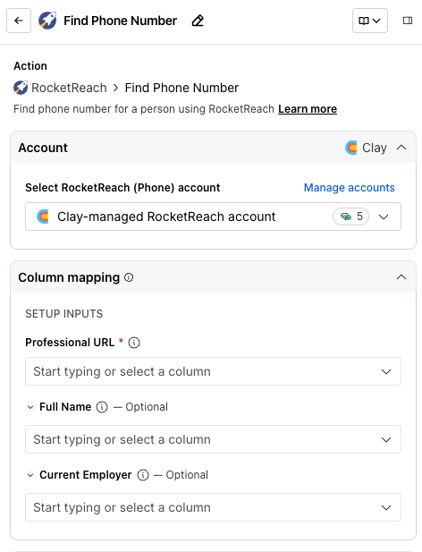

# RocketReach integration overview

Enrich people and companies and find verified emails and phone numbers.

## **Getting started with RocketReach**

RocketReach in Clay allows you to enrich people and companies, and find verified professional emails and phone numbers using a professional profile URL, name and company, or email.

There are many actions you can do with [RocketReach](https://www.clay.com/integrations/data-provider/rocketreach), including:

-   Enrich Company
-   Enrich Person
-   Find Professional Email
-   Find Phone Number

We'll cover how to connect Clay to RocketReach, then we'll go over each action that is available with RocketReach.

But first let's talk a bit about data enrichment waterfalls.

## **Getting better email and phone number coverage with waterfall enrichments**

RocketReach is great for finding email and phone number contacts, but it's not the only way to get this data.

For better coverage on contact data, we recommend using [Clay's waterfall enrichments](https://www.clay.com/waterfall-enrichment), which will let you search sequentially across multiple data providers.

Learn more on how to use Clay waterfalls with this [Clay University lesson](https://www.clay.com/university/lesson/enrich-people-waterfalls-clay-101).

That said, let's get into it on how to use RocketReach with Clay!

## **Connecting with Clay with RocketReach**

### **Option 1: Use the Clay-managed RocketReach account**

By default, RocketReach enrichments will use the Clay-managed RocketReach account. This means that any new enrichment will charge the designated credit amount. Simply pull up any RocketReach enrichment within Clay to use the Clay-managed RocketReach account.

### **Option 2: Add your own RocketReach API key**

If you are currently on a paid plan, you can use your own RocketReach account within Clay through an API key.

**Important:** API key usage is only available on paid plans. Please upgrade to access the API key.

You can easily add your RocketReach API key through the enrichment panel when selecting an account.

### `Action` Enrich Company

The **Enrich Company** action enriches a company with RocketReach data using the company's domain.

**Step 1: Choose the RocketReach account you want to use**

First, you can use either the Clay-managed RocketReach account or your own API key.

If you use the Clay-managed RocketReach (Standard) account you will be charged at 8 credits per enriched cell. For more information on how Clay credits work, please refer to [this guide](https://www.clay.com/university/lesson/clay-credits-overview).

**Step 2: Enter optional and required setup inputs**

Enter the **Company Domain** (required) of the company you want to enrich. You can optionally provide the **Company Professional URL**, **Name**, and **Stock Ticker** to improve the match.

**Step 3 (Optional): Select Auto-update**

By default, RocketReach will auto-update the integration every 24 hours. This is optional. Make sure to toggle this step off if you do not want to auto-update, however, you might run into stale data problems.

For more information about how auto-update works, please read [this brief guide](https://docs.clay.com/en/articles/9642165-auto-update-and-auto-dedupe-table).

**Step 4 (Optional): Select conditional run criteria**

If you want to only run this enrichment under set circumstances, you are able to input formulas where the column runs only if the formula is true. Learn more about conditional runs in [this Clay University lesson](https://www.clay.com/university/lesson/ai-formulas-conditional-runs-clay-101#:~:text=Conditional%20runs%20\(which%20make%20use,personal%20emails%20for%20all%20rows\).\)).

**Step 5: Choose data to add as columns to table**

Select which data from the enrichment you'd like to add as columns to your table. Even if you choose not to add columns at this point, the enriched data will still be available and accessible for later use.

### `Action` Enrich Person

The **Enrich Person** action enriches a person with RocketReach data.

**Step 1: Choose the RocketReach account you want to use**

First, you can use either the Clay-managed RocketReach account or your own API key.

If you use the Clay-managed RocketReach - Enrich Person account you will be charged at 1 credit per enriched cell. For more information on how Clay credits work, please refer to [this guide](https://www.clay.com/university/lesson/clay-credits-overview).

**Step 2: Enter optional and required setup inputs**

Enter the person's **Personal identifiers**. One of the following inputs is required: **Name** and **Current Employer**, **Professional URL**, or **Email**. You can optionally provide a **Job Title** to improve the match.

**Step 3 (Optional): Select Auto-update**

By default, RocketReach will auto-update the integration every 24 hours. This is optional. Make sure to toggle this step off if you do not want to auto-update, however, you might run into stale data problems.

For more information about how auto-update works, please read [this brief guide](https://docs.clay.com/en/articles/9642165-auto-update-and-auto-dedupe-table).

**Step 4 (Optional): Select conditional run criteria**

If you want to only run this enrichment under set circumstances, you are able to input formulas where the column runs only if the formula is true. Learn more about conditional runs in [this Clay University lesson](https://www.clay.com/university/lesson/ai-formulas-conditional-runs-clay-101#:~:text=Conditional%20runs%20\(which%20make%20use,personal%20emails%20for%20all%20rows\).\)).

**Step 5: Choose data to add as columns to table**

Select which data from the enrichment you'd like to add as columns to your table. Even if you choose not to add columns at this point, the enriched data will still be available and accessible for later use.

### `Action` Find Professional Email

The **Find Professional Email** action finds a person's work email using RocketReach.

**Step 1: Choose the RocketReach account you want to use**

First, you can use either the Clay-managed RocketReach account or your own API key.

If you use the Clay-managed RocketReach (professional email) account you will be charged at 6 credits per enriched cell. For more information on how Clay credits work, please refer to [this guide](https://www.clay.com/university/lesson/clay-credits-overview).

**Step 2: Enter optional and required setup inputs**

Enter the contact's **Professional URL** (required) to find their work email. You can optionally provide the **Full Name** and **Current Employer** to improve the match.

**Step 3 (Optional): Select Auto-update**

By default, RocketReach will auto-update the integration every 24 hours. This is optional. Make sure to toggle this step off if you do not want to auto-update, however, you might run into stale data problems.

For more information about how auto-update works, please read [this brief guide](https://docs.clay.com/en/articles/9642165-auto-update-and-auto-dedupe-table).

**Step 4 (Optional): Select conditional run criteria**

If you want to only run this enrichment under set circumstances, you are able to input formulas where the column runs only if the formula is true. Learn more about conditional runs in [this Clay University lesson](https://www.clay.com/university/lesson/ai-formulas-conditional-runs-clay-101#:~:text=Conditional%20runs%20\(which%20make%20use,personal%20emails%20for%20all%20rows\).\)).

**Step 5: Choose data to add as columns to table**

Select which data from the enrichment you'd like to add as columns to your table. Even if you choose not to add columns at this point, the enriched data will still be available and accessible for later use.

### `Action` Find Phone Number

The **Find Phone Number** action finds a person's phone number using RocketReach.

**Step 1: Choose the RocketReach account you want to use**

First, you can use either the Clay-managed RocketReach account or your own API key.

If you use the Clay-managed RocketReach (Phone) account you will be charged at 5 credits per enriched cell. For more information on how Clay credits work, please refer to [this guide](https://www.clay.com/university/lesson/clay-credits-overview).

**Step 2: Enter optional and required setup inputs**

Enter the contact's **Professional URL** (required) to find their phone number. You can optionally provide the **Full Name** and **Current Employer** to improve the match.

**Step 3 (Optional): Select Auto-update**

By default, RocketReach will auto-update the integration every 24 hours. This is optional. Make sure to toggle this step off if you do not want to auto-update, however, you might run into stale data problems.

For more information about how auto-update works, please read [this brief guide](https://docs.clay.com/en/articles/9642165-auto-update-and-auto-dedupe-table).

**Step 4 (Optional): Select conditional run criteria**

If you want to only run this enrichment under set circumstances, you are able to input formulas where the column runs only if the formula is true. Learn more about conditional runs in [this Clay University lesson](https://www.clay.com/university/lesson/ai-formulas-conditional-runs-clay-101#:~:text=Conditional%20runs%20\(which%20make%20use,personal%20emails%20for%20all%20rows\).\)).

**Step 5: Choose data to add as columns to table**

Select which data from the enrichment you'd like to add as columns to your table. Even if you choose not to add columns at this point, the enriched data will still be available and accessible for later use.
